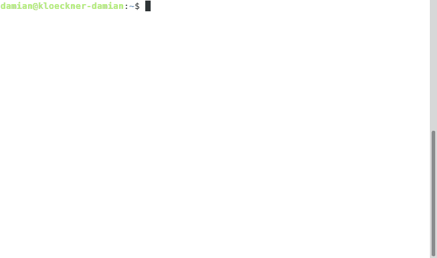

# Can Haz Password?

A Go library for generating random, rule based passwords. Many random, much
secure.

## Features

* Randomized password length (bounded).
* Tunable password composition (eg. special character frequency).
* Password complexity enforcement.
* Rules support for enforcing custom requirements.

## Quickstart

An example implementation of a password generator utilizing this library is 
available [cmd/main.go](cmd/main.go).

## Demonstration



## Documentation

Documentation is available in the [docs](docs) subdirectory.

## Developing

### Prerequisites

* Make
* [Go 1.13](https://golang.org/dl/) (or greater)
* [golangci-lint](https://golangci-lint.run)

### Build

Lint, and test your changes:

```console
make lint test
```

### Run

To generate a new random password:

```console
make run
```

## Issues

If you find a bug or have a feature request, please report them via this 
repositories issues section. If you find a security vulnerability please
first contact
[the security team](mailto:kciopensource@kloeco.emea.microsoftonline.com?subject=Can%20Haz%20Password%20Vulnerability%20Report)
for responsible disclosure information. Do not post security vulnerabilities as
public GitHub issues.
